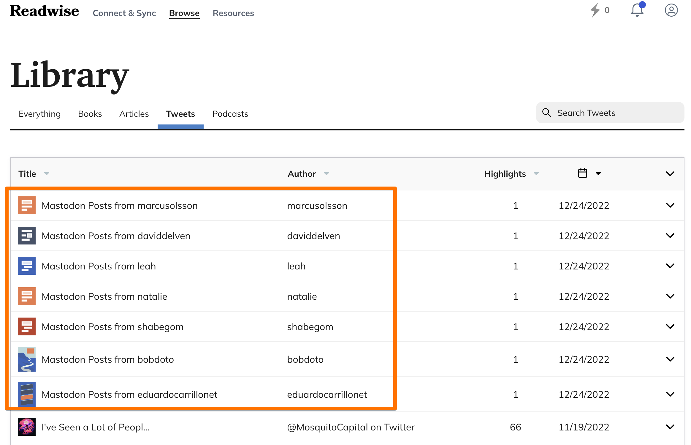
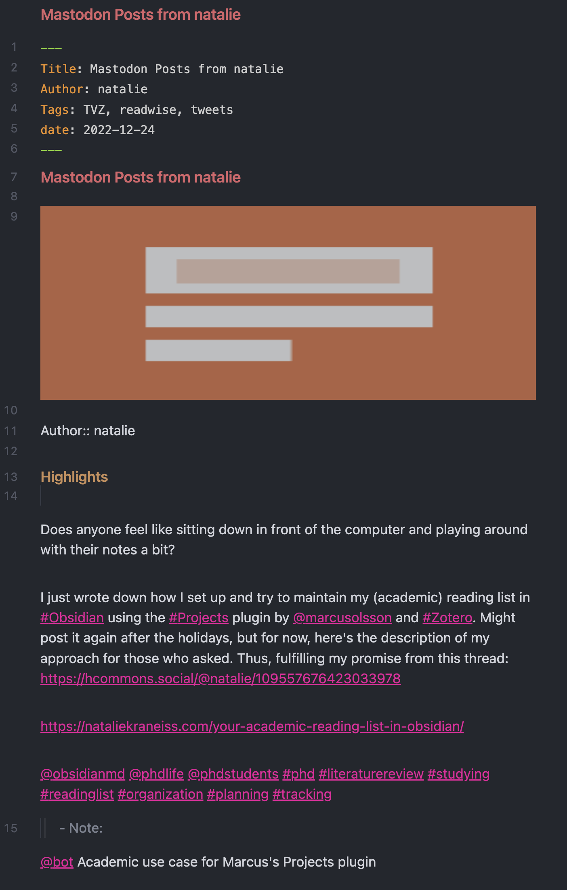

# mastobot
Mastodon bot for sending Mastodon posts to Readwise.

## Pre-requisites

- A Mastodon account (I use and co-host [pkm.social](https://pkm.social) for free)
- A Readwise account ([Here's an affiliate link](https://readwise.io/nicole))
- Familiarity with GitHub, the command line, Node.js

## Usage

1. Clone this repository.
2. In your Mastodon account settings, go to the Development section for your Mastodon server (e.g. `https://pkm.social/settings/applications`) and click New Application.
3. Fill in the application name (this can be anything you want), leave everything else the same, and then click Save Changes.
4. Click on the application you just created, and note your client key, client secret, and access token. You'll need these later.
5. In this repository, copy the contents of `.env.sample` to a new file called `.env`.
6. Fill out the fields in `.env` with the information you just obtained from your Mastodon account.
7. For the `READWISE_TOKEN` field, enter your [Readwise access token](https://readwise.io/access_token).
8. For the `DOMAIN` field, enter your Mastodon server's domain (e.g. `https://pkm.social`).
9. Run `npm install` to install the dependencies.
10. Run `node bot.js` to start the bot.
11. In Mastodon, find a post you like and reply to it with `@botname Your comment here.` Within a few minutes, the original post you replied to will be sent to your Readwise account as a highlight and your comment as a note.

(Optional) If you use [Obsidian](https://obsidian.md) and you have the Readwise Official plugin installed and automatically syncing, the Mastodon posts you've replied to will show up in your Obsidian vault!

## Screenshots

### Mastodon posts on the Readwise Dashboard

### Mastodon posts after import into Obsidian

(Note: The exact formatting of the post will depend on your Readwise settings.)